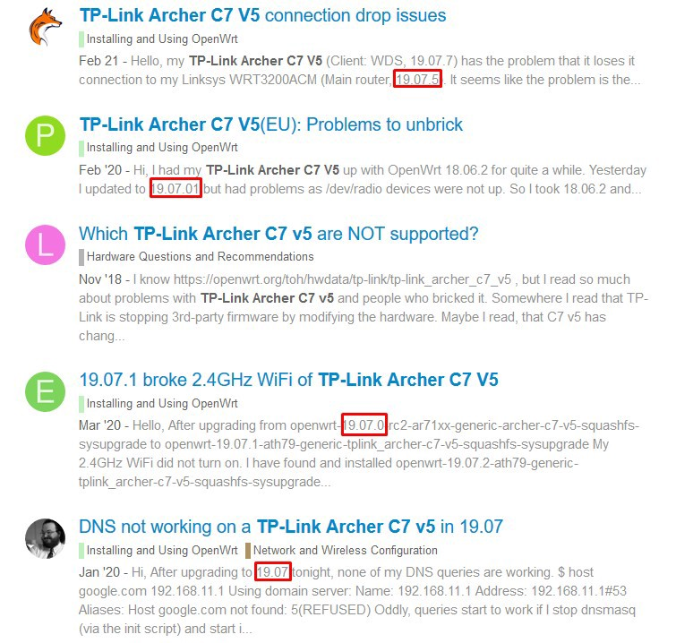

# Disclaimer

This guide is a little outdated, you should use OpenWrt version 21. I have created an updated Guide [here](/2022/03/12/tp-link-archer-c7-v5-openwrt).

# The Technical Details
[Techdata: TP-Link Archer C7 AC1750 v5](https://openwrt.org/toh/hwdata/tp-link/tp-link_archer_c7_v5)

(If you don´t want to read all of this in short it means that the Router should have enough power to run current OpenWrt versions.)

# The Problem with the Versions

The Archer C7 is supported by two major versions of OpenWrt: Version 18 and 19. But in the Forum for the Archer C7 are some threads that point out Issues with the latest release. So I am going to use the Router with Version 18 because it seems more stable.



# The right Firmware Image

When installing OpenWrt for the first time you search for a Firmware image that looks like that:

```plaintext
    openwrt-19.07.7-ath79-generic-tplink_archer-c7-v5-squashfs-factory.bin
```

The place to search for the right Firmware is on the OpenWrt page of the router, but because I don´t want the latest version I need to search on the Download Server:

Version 19: [https://downloads.openwrt.org/releases/19.07.7/targets/ath79/generic/](https://downloads.openwrt.org/releases/19.07.7/targets/ath79/generic/)

Version 18: [https://downloads.openwrt.org/releases/18.06.9/targets/ar71xx/generic/](https://downloads.openwrt.org/releases/18.06.9/targets/ar71xx/generic/)

Version 18 alternative:

[https://web.archive.org/web/20210405170819/https://downloads.openwrt.org/releases/18.06.9/targets/ar71xx/generic/](https://web.archive.org/web/20210405170819/https://downloads.openwrt.org/releases/18.06.9/targets/ar71xx/generic/)

The Latest Version I have found was: [https://downloads.openwrt.org/releases/18.06.9/targets/ar71xx/generic/openwrt-18.06.9-ar71xx-generic-archer-c7-v5-squashfs-factory.bin](https://downloads.openwrt.org/releases/18.06.9/targets/ar71xx/generic/openwrt-18.06.9-ar71xx-generic-archer-c7-v5-squashfs-factory.bin)

After you have the right image you need to rename it to:

```firmware.bin```

# Flashing the Firmware (Web interface Methode)

I am going to use the Web interface method because it is stable enough on my Stock firmware version.

Connect to the Router via Wifi and set up a Password. After that, you can connect with an Ethernet Cable and log in. (The Stock Web interface is located here: ```192.168.0.1```)

(The Images Below are from the [TP-Link Emulator](https://emulator.tp-link.com/archer-c7-v5/index.html))

You just need to go to Advanced > System Tools > Firmware Upgrade
Step 1: 


Step 2: 


Then select the firmware.bin and click on upgrade. This process can take up to 5 Minutes.
Step 3,4 and 5: 


After that, you just need to go to ```http://192.168.1.1``` and there is the Web interface.
The OpenWrt Webinterface LuCI: 


