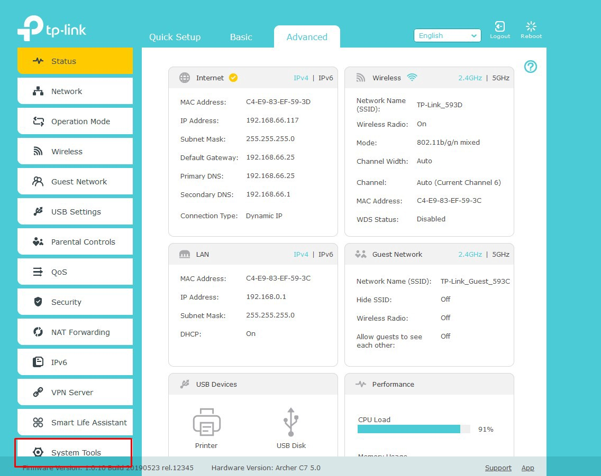

# The Technical Details
[Techdata: TP-Link Archer C7 AC1750 v5](https://web.archive.org/web/20220609111144/https://openwrt.org/toh/hwdata/tp-link/tp-link_archer_c7_v5)

(If you don´t want to read all of this in short it means that the Router should have enough power to run current OpenWrt versions.)

# The right Firmware Image

When installing OpenWrt for the first time you search for a Firmware image that looks like that:

```tplink_archer-a7-v5-squashfs-factory.bin```

Version 21: [https://downloads.openwrt.org/releases/21.02.2/targets/ath79/generic/openwrt-21.02.2-ath79-generic-tplink_archer-a7-v5-squashfs-factory.bin](https://downloads.openwrt.org/releases/21.02.2/targets/ath79/generic/openwrt-21.02.2-ath79-generic-tplink_archer-a7-v5-squashfs-factory.bin)

After you have the right image you need to rename it to:

```firmware.bin```

# Flashing the Firmware (Web interface Methode)

I am going to use the Web interface method because it is stable enough on my Stock firmware version.

Connect to the Router via Wifi and set up a Password. After that, you can connect with an Ethernet Cable and log in. (The Stock Web interface is located here: ```192.168.0.1```)

(The Images Below are from the [TP-Link Emulator](https://emulator.tp-link.com/archer-c7-v5/index.html))

You just need to go to Advanced > System Tools > Firmware Upgrade
Step 1: 


Step 2: 


Then select the firmware.bin and click on upgrade. This process can take up to 5 Minutes.
Step 3,4 and 5: 


After that, you just need to go to ```http://192.168.1.1``` and there is the Web interface.
The OpenWrt Webinterface LuCI: 
