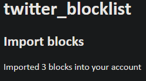

# Notice

As of March 31, 2023, this method is not a good way of blocking Advertising on Twitter; you should just use something like [uBlock Origin](https://ublockorigin.com/) or alternative Apps.

## Requirements
For following this Guide, you need the following:

- [a Twitter Developer Account](https://developer.twitter.com/)
Your Twitter Data Archive](https://twitter.com/settings/download_your_data)
- [the program](https://github.com/Nickwasused/twitter-data-export-to-blocklist)
- [Python3 and pip3](https://www.python.org/)

## Program Setup
Let's start by getting the Program set up.

First, we need to install the requirements by running 
```bash
pip3 install -r requirements.txt --user
```

After that, you need to copy the ```.env.example``` file to ```.env```

Now you have to get your Twitter Developer Credential and fill it in the ```.env``` file.

```plaintext
API_KEY=""
API_SECRET=""
ACCESS_TOKEN=""
ACCESS_TOKEN_SECRET=""
```

You have to get them on the Twitter Developer Site > your App > Keys and Tokens:


## Twitter Data
Now [get your Twitter Data Archive from here](https://twitter.com/settings/download_your_data)

After you have requested the Archive wait for the Notification Email. (This can take hours to days!)

Unpack the archive into the folder called ```export```.

The directory structure should look like this now:
```plaintext
- export
    - assets
    - data
    - .gitkeep
    - Your archive.html
- .env
- main.py
...
```

## Get the List

Now you just must run: ```bash
python3 main.py
```

The script will output a file called ```export.csv``` and tell you how many Advertising Accounts you have seen. For me, it was around 750 Accounts, but in this example, I will use a list of 3 Accounts.

## Block the Accounts

To Block the accounts, you need to upload the ```export.csv``` content to [Pastebin](https://pastebin.com) or another site.

Paste the contents ```export.csv``` in the input field and click ```create Paste```. 


Now you are redirected to your paste. Click on ```raw``` and copy the link. 


Now go to this site: [https://twitter-blocklist-auth.glitch.me/](https://twitter-blocklist-auth.glitch.me/) and log in.

Now you can paste the URL you have copied before in the field and click Submit.


After that, the Page will tell you how many Accounts got blocked.


### archive

The following links are archived versions, as the main ones could break.

[https://ublockorigin.com/](https://web.archive.org/web/20240519173755/https://ublockorigin.com/)  
[https://developer.twitter.com/](https://web.archive.org/web/20221030110754/https://developer.twitter.com/en)  
[https://github.com/Nickwasused/twitter-data-export-to-blocklist](https://web.archive.org/web/20240519173959/https://github.com/Nickwasused/twitter-data-export-to-blocklist)  
[https://www.python.org/](https://web.archive.org/web/20240519112608/https://www.python.org/)  
[https://pastebin.com](https://web.archive.org/web/20240519105333/https://pastebin.com/)  
[https://twitter-blocklist-auth.glitch.me/](https://web.archive.org/web/20240308204003/https://twitter-blocklist-auth.glitch.me/)  