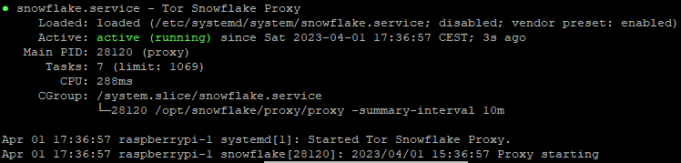

This is a guide for installing a tor snowflake on your Raspberry Pi as systemd service.

Tor snowflake: ["Allows people from anywhere in the world to access censored websites and applications."](https://snowflake.torproject.org/)

## Requirements

I have certain requirements for this guide. Using this guide on any other system is properly unsupported! Use at your own risk.

- DietPi version v8.15.2 or above
- Debian version based on bullseye (check with `cat /etc/os-release`)

Notice that I am creating this guide from the view of a User account with sudo rights and a headless setup.

## Install GO

First, we need to install [Go](https://go.dev/) version 1.13 or higher.

We install Go using:
```shell
sudo dietpi-software
```

now search for `go` and select the following by pressing space. `Go: Runtime environment and package installer`

After that press TAB and select confirm, when back on the main page select `install`

Now reload your shell by running `exec bash` or reconnect.

To verify the Go install run `go version`, it should output something like `go version go1.20.2 linux/arm64`. Just make sure that the version is 1.13 or higher.

## Snowflake

Now we can start to install the snowflake.

First change to the `/opt` directory: `cd /opt`

**Notice the sudo in front!**

Start by cloning the Git repository: 
```shell
sudo git clone https://git.torproject.org/pluggable-transports/snowflake.git
```

and then get ownership of the folder: 
```shell
sudo chown -R $USER:$USER snowflake/
```

Now we can start to build the program itself: 
```shell
cd snowflake/proxy && go build
```

To verify that the build is working, run `./proxy`. The output should look like: `2023/04/01 15:29:14 Proxy starting`

# Autostart

To autostart the program, we are going to use systemd.

Start by creating a new user: 
```shell
sudo adduser --no-create-home --disabled-login snowflake
```

This will create the user snowflake, but we still need to give the user access to the snowflake folder: 
```shell
sudo chown -R $USER:snowflake /opt/snowflake
```
and 
```shell
sudo chmod -R 775 /opt/snowflake/
```

Create the systemd service file like this: 
```shell
sudo nano /etc/systemd/system/snowflake.service
```

With the following content:
```bash
[Unit]
Description=Tor Snowflake Proxy
After=network.target
StartLimitIntervalSec=0

[Service]
LogLevelMax=6
Type=simple
User=snowflake
SyslogIdentifier=snowflake
StandardOutput=journal
StandardError=journal
ExecStart=/opt/snowflake/proxy/proxy -summary-interval 10m
Restart=on-failure
RestartSec=120
TimeoutSec=300
PrivateTmp=true
NoNewPrivileges=true
ProtectSystem=strict
ProtectHome=false
ReadOnlyDirectories=/
ReadWriteDirectories=/opt/snowflake/

[Install]
WantedBy=multi-user.target
```

To verify that everything is working as intended, run: `sudo service snowflake start` and after that `sudo service snowflake status`.

The output should look like this:


To enable the automatic start on reboot, run: 
```shell
sudo systemctl enable snowflake.service
```

# Logs

This section is useful if you want to have usage logs.

We start by editing the rsyslog config: `sudo nano /etc/rsyslog.d/50-default.conf` and add the following line 

```bash 
:programname,isequal,"snowflake" /var/log/snowflake.log
```

To apply this change, restart `rsyslog`: `sudo service rsyslog restart`.

To see the new log, wait up to 10 minutes or restart the `snowflake` service like this: `sudo service snowflake restart`.

You can now see the log like this: `sudo tail -f /var/log/snowflake.log` or this: `sudo cat /var/log/snowflake.log`.

After some time the log should have lines like: `2023/04/01 15:54:08 In the last 10m0s, there were 0 connections. Traffic Relayed ↓ 0 KB, ↑ 0 KB.`, these indicate the usage of the proxy you are hosting.

## Logrotate

Logrotate is used to keep older logs and compress them with a defined limit.

Start by creating a config file for snowflake: `sudo nano /etc/logrotate.d/snowflake` with the following content:
```bash
/var/log/snowflake.log { 
    su root root
    daily
    rotate 5
    compress
    delaycompress
    missingok
    postrotate
        systemctl restart rsyslog > /dev/null
    endscript    
}
```

To finalize everything, reboot the system: `sudo reboot`.
